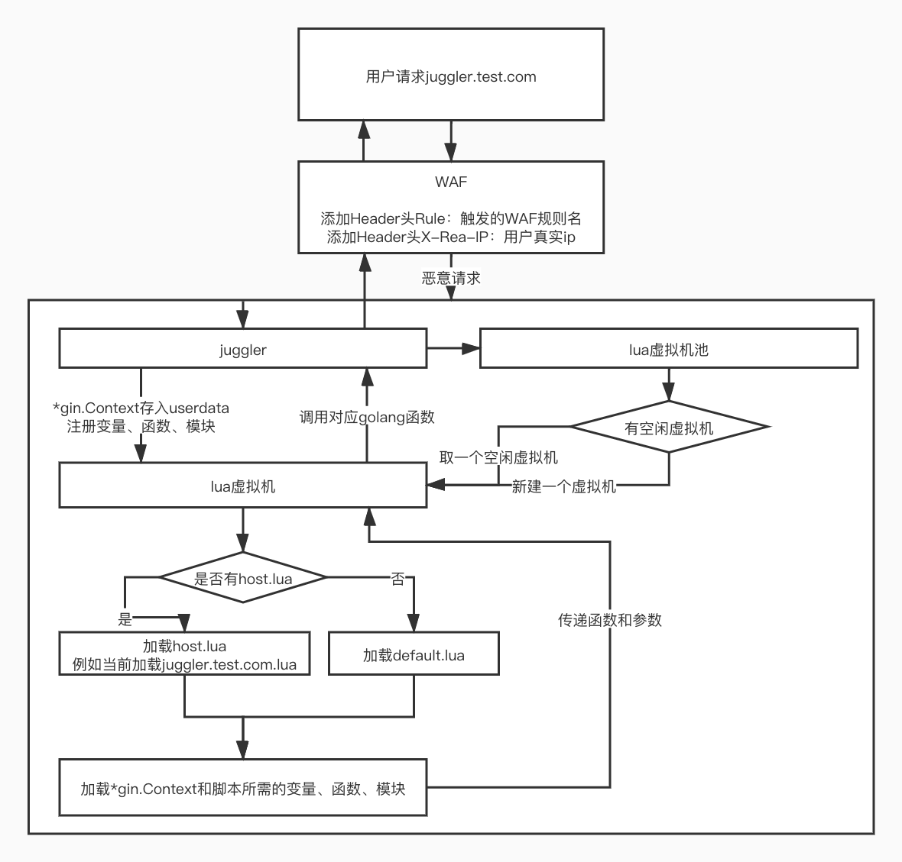
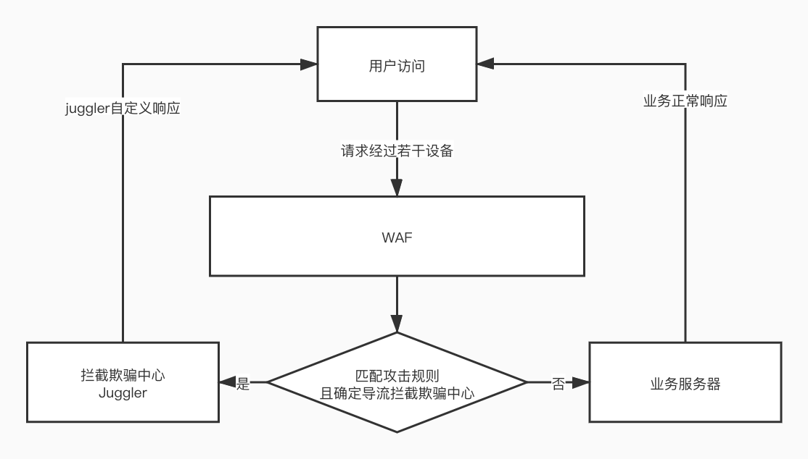

# Juggler - 一个也许能骗到黑客的系统

## 应用场景
现在很多WAF拦截了恶意请求之后，直接返回一些特殊告警页面（之前有看到t00ls上有看图识WAF）或一些状态码（403或者500啥的）。

但是实际上返不返回特殊响应都不会有啥实际作用，反而会给攻击者显而易见的提示。

但是如果返回的内容跟业务返回一致的话，就能让攻击者很难察觉到已经被策略拦截了。

场景一：攻击者正在暴力破解某登陆口
```
发现登陆成功是
{"successcode":0,"result":{"ReturnCode":0}}
登陆失败是
{"errorcode":1,"error":"用户名密码不匹配","result":{"ReturnCode":0}}
```
那现在我们可以这么做
```
1. 触发规则后持续返回错误状态码，让黑客觉得自己的字典不大行。
2. 返回一个特定的cookie，当waf匹配到该cookie后，将请求导流到某web蜜罐跟黑客深入交流。
```

场景二：攻击者正在尝试找xss

我们可以这么做
```
例如：
1. 不管攻击者怎么来，检测后都返回去去除了攻击者payload的请求的响应。
2. 攻击者payload是alert(xxxx)，那不管系统有无漏，我们返回一个弹框xxx。
  （当然前提是我们能识别payload的语法是否正确，也不能把攻击者当傻子骗。）
```

肯定有人会觉得，我们WAF强的不行，直接拦截就行，不整这些花里胡哨的，那这可以的。

但是相对于直接的拦截给攻击者告警，混淆视听，消费攻击者的精力，让攻击者怀疑自己，这样是不是更加狡猾？这也正是项目取名的由来，juggler，耍把戏的人。

当然，上面需求实现的前提，是前方有一个强有力的WAF，只有在攻击请求被检出后，攻击请求才能到达我们的拦截欺骗中心，否则一切都是扯犊子。

```
项目思路来自我的领导们，并且简单的应用已经在线上有了很长一段时间的应用，我只是思路的实现者。
项目已在线上运行一年多，每日处理攻击请求过亿。

juggler本质上是一个lua插件化的web服务器，类似openresty（大言不惭哈哈）；
基于gin进行的开发，其实就是将*gin.Context以lua的userdata放入lua虚拟机，所以可以通过lua脚本进行请求处理。
```

### 性能

跟gin进行对比，性能损失大概10%。

虽然每个请求的真实处理还是在golang中完成，但是每个请求的一些临时变量都会在lua虚拟机走一遍。

gin逻辑
```go
func handler(c *gin.Context) {
    c.String(200, "host of this request is %s", c.Request.Host)
}
```
juggler逻辑
```lua
local var = rock.var
local resp = rock.resp

resp.string(200, "host of this request is %s", var.host)
```

### 使用方式

项目流程图


示例插件

```lua
-- juggler.test.com.lua
-- 文件名juggler.test.com.lua 当攻击请求的业务域名是juggler.test.com时匹配该插件
local var = rock.var
local resp = rock.resp
local crypto = require("crypto")
local time = require("time")
local re = require("re")
local log = rock.log
local ERR = rock.ERROR

-- 通过var内的参数，匹配每一个攻击请求中的http参数
if var.rule == "sqli" then
    -- 满足条件后直接返回格式化字符串，使用内置方法每次回显不同的32位随机md5值
    resp.string(200, "Congratulation！Password hash is %s.", crypto.randomMD5(32))
    -- 在日志文件中打印日志
    log(ERR, "found sqli attack in %d", time.format())
    return
end

-- 使用正则匹配某个路径，与规则匹配并用
if var.rule == "xss" and re.match(var.uri, "^/admin/") then
    -- 设置响应体类型
    resp.set_header("Content-Type", "text/html; charset=utf-8")
    -- 添加响应头Date，内容是正常服务器产生的内容
    resp.set_header("Date", time.server_date())
    -- 只响应状态码，不响应内容
    resp.status(403)
    return
end

if var.rule == "lfi_shadow" then
    -- 使用预存文件etc_shadow.html进行内容回显，状态码200
    resp.html(200, "etc_shadow")
    return
end

if var.rule == "rce" then
    resp.set_header("Content-Type", "text/html; charset=utf-8")
    -- 在响应中set_cookie
    resp.set_cookie("sessionid", "admin_session", 6000, "/", var.host, true, true)
    -- 克隆固定页面回显，缓存内容，不会每次都克隆
    resp.clone(200, "https://duxiaofa.baidu.com/detail?searchType=statute&from=aladdin_28231&originquery=%E7%BD%91%E7%BB%9C%E5%AE%89%E5%85%A8%E6%B3%95&count=79&cid=f66f830e45c0490d589f1de2fe05e942_law")
    return
end

-- 不匹配任何规则时，返回默认404内容
resp.set_header("Content-Type", "text/html; charset=utf-8")
resp.html(404, "default_404")
return
```

## 特点

### 插件编写灵活

插件支持lua所有常见语法，暂时不支持goto。可以调用预先注册好的变量、函数、模块。

实现个很简单的响应状态码404的页面。

```lua
local var = rock.var
local resp = rock.resp

resp.set_header("Content-Type", "text/html; charset=utf-8")
resp.string(404, "this is 404 page! your host is %s, your ip is %s.", var.host, var.addr)
```

### 插件和响应文件被动式更新

加载时会初始化所有的插件和响应内容文件。


使用inotify来监听文件行为，实现被动式的更新，不用写那个多主动轮询的for循环。


### 丰富三方插件库可自行定义

juggler中的lua插件除了lua本身的一些变量，其他的都是由golang实现后注册进lua虚拟机供lua进行调用的。

例如定义一个生成随机数的golang-lua函数

```go
// L是lua虚拟机
var L *lua.LState
// 注册这个模块
L.PreloadModule("random", luaRandom)

// golang中定义的可在lua中使用的生成随机数方法
var randFns = map[string]lua.LGFunction{
	"rint" : rint,
}

func rint(L *lua.LState) int {

	rand.Seed(time.Now().UnixNano())
	L.Push(lua.LNumber(rand.Intn(L.CheckInt(1))+1))
	return 1
}
```

lua使用方式

```lua
local random = require("random")
print(random.rint(3))
-- 每次运行会打印 0,1,2 中的一个
```

## 已实现需求

### 功能

### 每个请求可操作的变量和函数

####1. 项目全局根变量：rock

项目所有的变量的，类型是table。

####2. http请求：rock.var

包含了部分的当前请求的参数，具体参数见golua/request.go，已经覆盖了常见的参数了

```go
    case "host":
		L.Push(lua.LString(r.Host))
	case "status":
		L.Push(lua.LNumber(w.Status()))
	case "xff":
		L.Push(lua.LString(r.Header.Get("x-forwarded-for")))
	case "rule":
		L.Push(lua.LString(r.Header.Get("rule")))
	case "size":
		L.Push(lua.LNumber(w.Size()))
	case "method":
		L.Push(lua.LString(r.Method))
	case "uri":
		L.Push(lua.LString(r.URL.Path))
	case "app":
		L.Push(lua.LString(r.Header.Get("x-Rock-APP")))
	case "addr":
		L.Push(lua.LString(r.Header.Get("x-real-ip")))
	case "saddr":
		L.Push(lua.LString(r.RemoteAddr))
	case "query":
		L.Push(lua.LString(r.URL.RawQuery))
	case "ref":
		L.Push(lua.LString(r.Referer()))
	case "ua":
		L.Push(lua.LString(r.UserAgent()))
	case "ltime":
		L.Push(lua.LNumber(time.Now().Unix()))
	default:
		L.Push(lua.LNil)
```

####3. http响应：rock.resp

处理响应，通过每个请求的*gin.Context存在userdata的值进行操作

```lua
local resp = rock.resp

-- 参数是状态码number类型，无返回
resp.status(200)
-- *gin.Context响应回显状态码

-- 参数是 状态码number类型、响应体是格式化字符串string类型、任意类型，无返回
resp.string(200, "return a string..%s", "xx")
-- *gin.Context响应回显状态码，并返回格式化字符串

-- 参数是 状态码number类型、响应体文件名是string类型、任意类型，无返回
-- 第二个参数对应的文件在项目html目录下，如输入juggler_404，那么实际内容就是juggler_404.html
-- 如果找不到该文件，就返回default_404.html的内容，所有内容会在第一次加载后缓存进内存
resp.html(200, "juggler_404")
-- *gin.Context响应回显状态码，和缓存页面内容（实际上也是格式化字符串）

-- 参数是 状态码number类型，url是string类型
-- 第二个参数是可以进行克隆的url，比如不方便直接存，那可以直接克隆，内容会在克隆完成一次后缓存进内存
resp.clone(200, "http://juggler.test.com/uri?p=1")
-- *gin.Context响应克隆出来的内容

-- 参数是 头的key和头的值，都是string类型，没有返回
resp.set_header("Content-Type", "text/html; charset=utf-8")
-- *gin.Context设置头参数

-- 参数是 cookie的key和值，都是string类型，生命周期number类型，作用路径和作用域名是string类型，secure和httponly是布尔类型，没有返回
resp.set_cookie("sessionid", "admin_session", 6000, "/", var.host, true, true)
-- *gin.Context设置cookie
```

### 内置模块、函数和对应需求

####1. 正则匹配：re

统一拦截规则可能会需要根据不同uri区分子业务来返回对应的欺骗页面

re中实现缓存，所以性能优于golang原生（虽然golang中的正则匹配性能一直被诟病

```lua
local var = rock.var
local re = require("re")

-- 参数是 待匹配字符串、正则匹配语法，返回bool类型
local res = re.match(var.uri, "^/admin/")
-- 输入 true或者false
```

####2. 时间相关：time

服务器的Date时间特定格式、使用unix时间戳计算、日志打印格式化时间

```lua
local time = require("time")

-- 没有参数，返回number类型
local zero = time.zero
-- 输出 1590829200，主要用来做差值算余数

-- 没有参数，返回string类型
local server_date = time.server_date()
-- 输出 Mon, 06 Jul 2020 15:28:49 GMT

-- 没有参数，返回string类型
local format_time = time.format()
-- 输出 2020-07-06 15:30:14
```

####3. 加密：crypto

业务上会有些接口，每次报错会返回一个随机md5，为了完全仿真，我们返回的数据的md5必然也要随机

```lua
local crypto = require("crypto")

-- 参数是string类型，返回string类型
local md5sum = crypto.md5sum("123")
-- 输出 202cb962ac59075b964b07152d234b70

-- 参数是16或32，number类型，返回string类型
local randomMD5 = crypto.randomMD5(16)
-- 输出一个随机的对应长度的md5
```

####4. 随机数：random

lua中使用随机数对table内容进行随机筛选，由于lua自带的随机数函数太不随机，所以自己实现

```lua
local random = require("random")

-- 参数是随机数范围，返回number类型
local ri = random.rint(3)
-- 输出 0,1,2 中的一个
```

####5. 日志打印：log、ERROR、DEBUG、INFO

ERROR、DEBUG、INFO都是日志等级

```lua
local log = rock.log
local ERR = rock.ERROR

-- 参数是 日志等级（number类型）、格式化字符串（string类型）、若干个填入内容（任意类型），没有返回
log(ERR, "this is a err msg.")
-- 日志中输出 2020/07/06 15:32:43 [error] this is a err msg.
```

## 联动WAF使用



## 本项目在现实中的应用

### WAF体系

本项目为拦截图中的拦截欺骗中心，接收并处理所有恶意请求。


### 日志分析风控系统

项目地址：[https://github.com/C4o/FBI-Analyzer](https://github.com/C4o/FBI-Analyzer)

### 实时日志传输模块

项目地址：[https://github.com/C4o/LogFarmer](https://github.com/C4o/LogFarmer)

